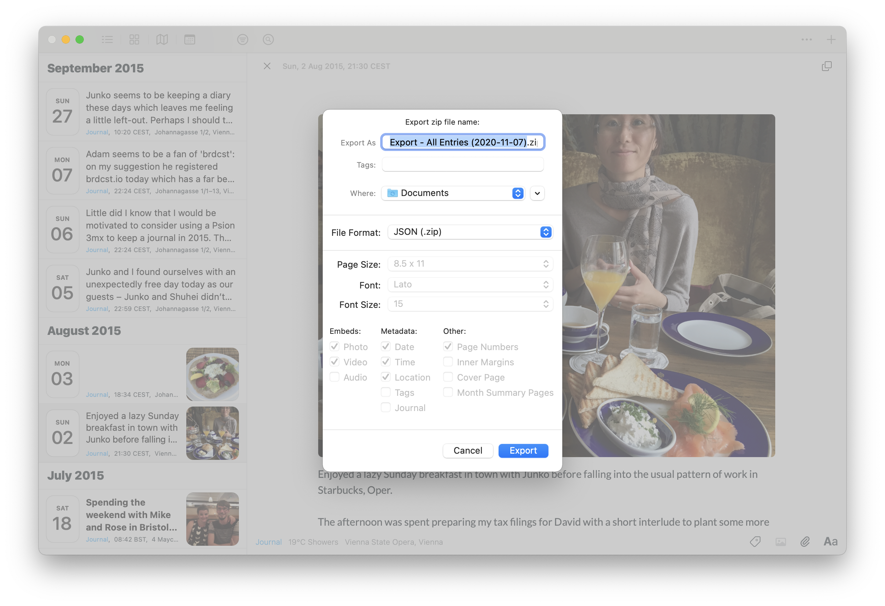

# day-one-to-markdown

Convert [Day One](https://dayoneapp.com) journal entries to [Markdown](https://daringfireball.net/projects/markdown) and [Front Matter](https://jekyllrb.com/docs/front-matter/).

## Introduction

[Day One](https://dayoneapp.com) doesn't make it easy to pull journal data out in a portable way.

`day-one-to-markdown` converts Day One's zipped JSON exports (of one or more journal entries), to a folder of Markdown files and attachments, suitable for use with blogging tools like [Jekyll](https://jekyllrb.com). All of the journal metadata ends up in [Front Matter](https://jekyllrb.com/docs/front-matter/), so it's immediately available to any page template.

## Installation

```bash
git clone git@github.com:jbmorley/day-one-to-markdown.git
cd day-one-to-markdown
pipenv install
```

## Usage

Exporting from Day One is simply a matter of selecting the entries you wish to export, and choosing the JSON format. On a Mac, this can be done from 'File > Export > JSON' (you can find detailed documentation for other platforms on the [Day One support pages](https://help.dayoneapp.com/en/articles/440668-exporting-entries)):



Once you have a zip file containing the export, perform the conversion by specifying the file, and target directory in which you wish the individual entires to be created. For example, the following command creates posts for the journal entries in 'Export - All Entries (20020-11-07).zip' in the drafts folder of my website:

```bash
day-one-to-markdown "Export - All Entries (20020-11-07).zip" ~/Site/content/drafts
```
